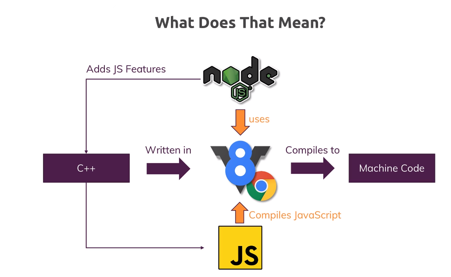
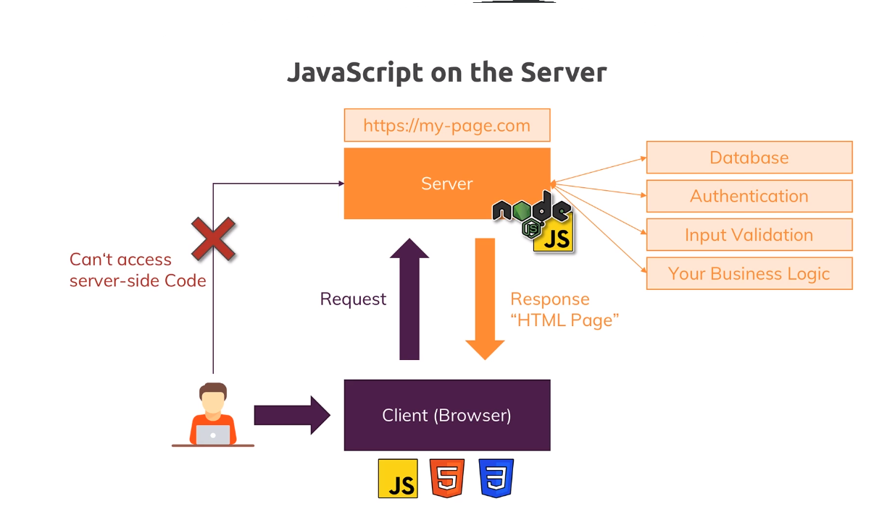
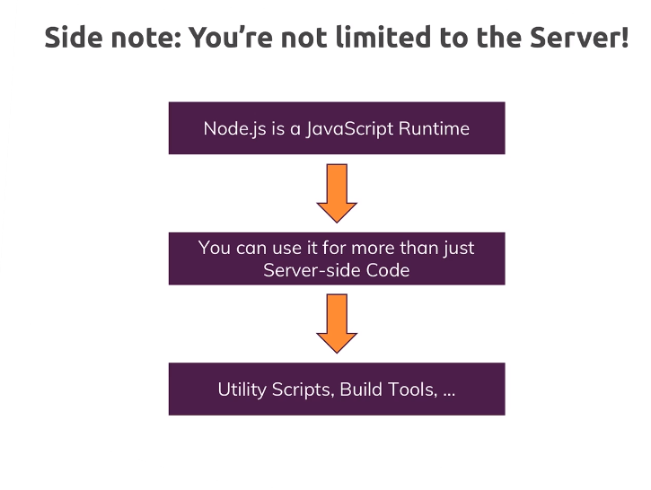
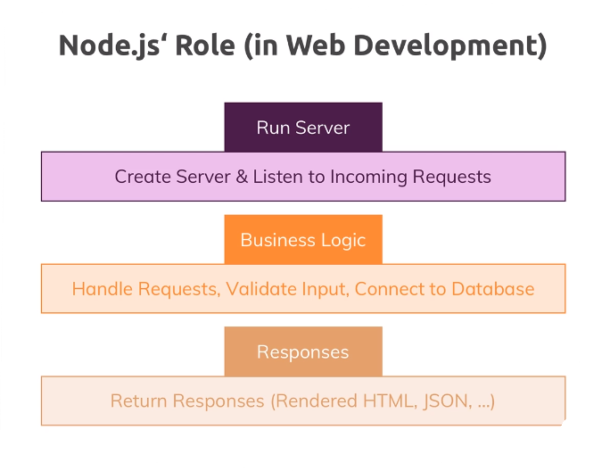

# Exploring Node.js, REST APIs, GraphQL, and Deno

## Node.js Introduction

*   JavaScript runtime environment 
*   Built on Chrome's V8 JavaScript engine
*   So this is how that works together and what nodejs does. It allows you to run javascript on your computer
    basically takes that v8 codebase which is written in C++ and adds certain features like for example     
    working with your local file system, opening files, reading files, deleting files,
    these are all things which are not possible in the browser, you can't access your local filesystem in the browser for security reasons, so this is not supported.
    **` Nodejs `** adds these features to  ` v8'`s engine 
     
    * node js not only for server *
### V8 Engine

*   Google-developed, open-source JavaScript engine
*   Powers JavaScript execution in Node.js and Chrome browser.
*   Known for its speed and optimization capabilities.

### Java Script on Server Side

## [Future Sections] 

*   REST APIs with Node.js
*   GraphQL with Node.js
*   Deno Introduction 
